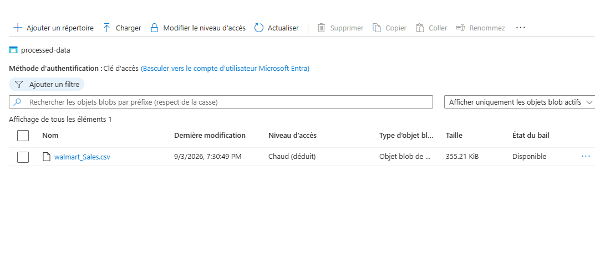
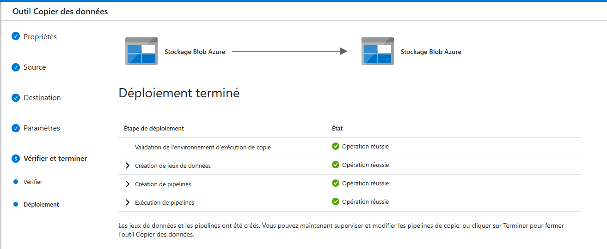

# 🛒 Walmart Sales Data Engineering Pipeline (Azure)

An end-to-end cloud data integration pipeline built using **Microsoft Azure Data Factory (ADF)** and **Azure Blob Storage** to automate the ingestion and transformation of Walmart sales data for portfolio and analytics purposes.

---

## 🏗️ Architecture & Infrastructure

* **Resource Group:** `walmart-rg`
* **Data Factory:** `WalmartDataFactory2026`
* **Storage Account:** `walmartstorage2026`
  * **Raw Container (`raw-data`):** Stores the initial incoming CSV files (`Walmart_Sales.csv`).
  * **Processed Container (`processed-data`):** Stores the transformed/transferred output data ready for consumption.

---

## ⚙️ Pipeline Workflow

1. **Source Connection:** Configured a linked service (`AzureBlobStorage1`) to connect Azure Blob Storage securely to Azure Data Factory.
2. **Copy Activity:** Created a robust ADF pipeline utilizing the Copy Tool to ingest `Walmart_Sales.csv` from the raw storage tier.
3. **Sink/Destination:** Processed and loaded the dataset cleanly into the `processed-data` container with headers preserved.

---

## 📸 Pipeline Execution Proof

Here is the successful execution and pipeline proof:

---

## 🚀 How to Run / Recreate
1. Provision an Azure Resource Group (`walmart-rg`).
2. Deploy an Azure Storage Account with two containers: `raw-data` and `processed-data`.
3. Create an Azure Data Factory instance (`WalmartDataFactory2026`).
4. Set up Blob Storage Linked Services and configure a Copy Data pipeline.
